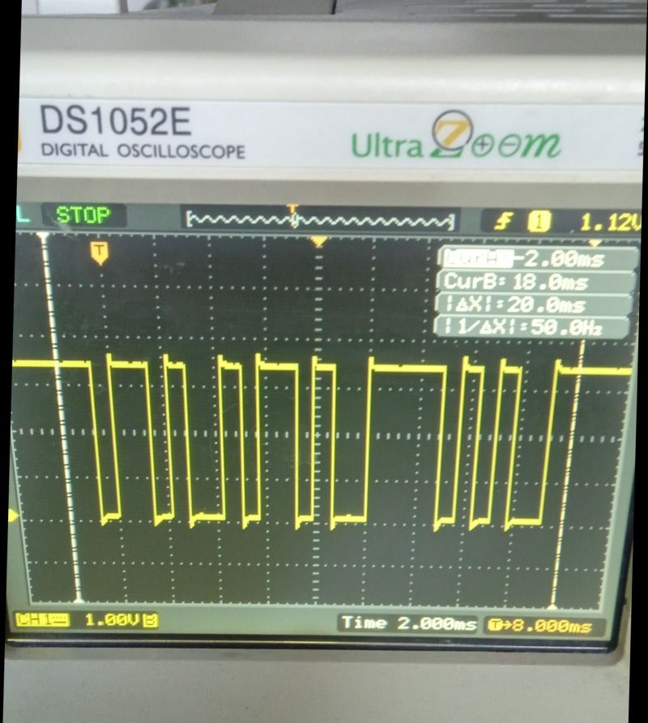
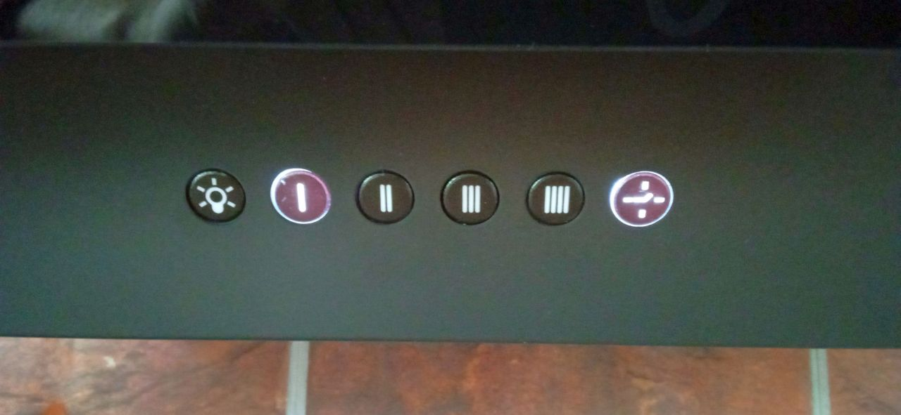
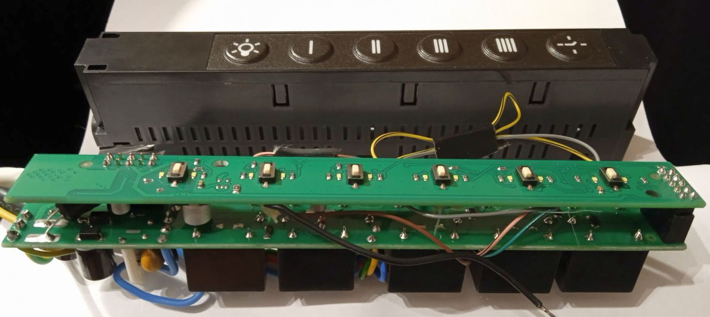
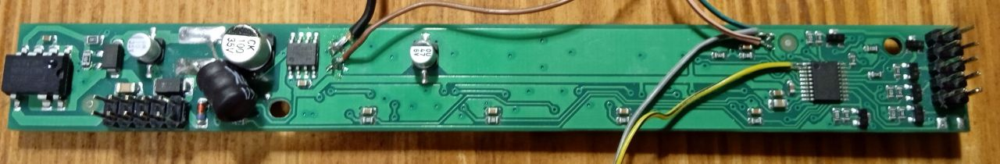
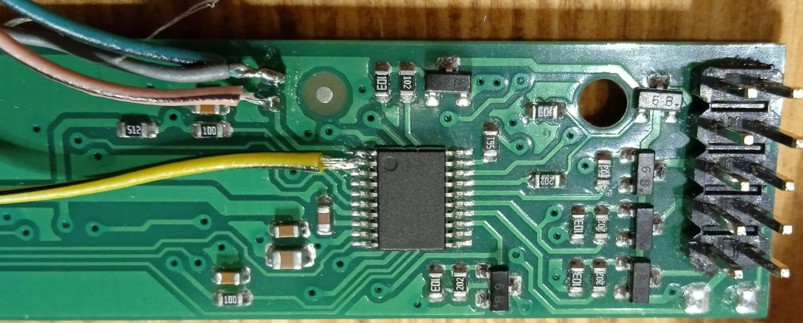
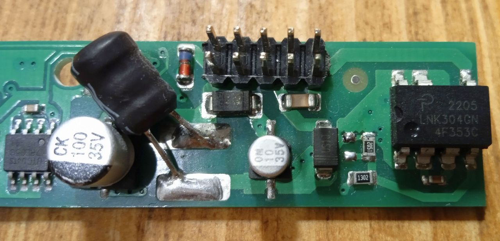

# Hob2Hood receiver

A little fun weekend project: modding the generic kitchen hood to be remote-controlled by the Electrolux hob.
The hobs with the Hob2Hood feature send IR commands to the hood, controlling fans and lamps. Some Hob2Hood variations are implemented by Electrolux, AEG, and Zanussi. According to Reddit, codes are at least partially compatible.

# Hob inspection

The hob have some modes for controlling the hood, enumerated as H0, H1, H2, H3, H4, H5, H6.
H0 disables the IR control, H1 controls the lamp only. H2 turns on the lamp and starts the fan when cooking.
Other modes are advertised as changing the fan speed in accordance with the cooking zone temperature.

The hood may be controlled manually by the dedicated button on the hob. Successive presses cycle between fan 0, fan 1, fan 2, fan 3, fan 0.

Oscilloscope time !

The IR modulation frequency is unknown, but likely to be the standard 36-38 kHz. The encoding is NRZ, as opposed
to the more common Manchester or pulse width. The bit rate is ~1400Hz. The message length is 23-25 bit.
The longest run of zeros or ones is 5 bits. Each message is repeated 3 times to increase the chance of reception.

Codes:

| Command            | Code                        | Hex (msb first) |
| ------------------ | --------------------------- | --------------- |
| Hob on (lamp on)   | `1001011010010110000101011` | `0x012D2C2B`    |
| Fan speed 1        | `1100100111001001010010001` | `0x01939291`    |
| Fan speed 2        | `110010000100011111000111`  | `0x00C847C7`    |
| Fan speed 3        | `10001111000011101000111`   | `0x00478747`    |
| Fan speed 4        | `1100011011000110010001011` | `0x018D8C8B`    |
| Fan off            | `1001001110010011000100101` | `0x01272625`    |
| Hob off (lamp off) | `1001010100010100100101`    | `0x00254525`    |

Legend: 0 - idle, 1 - active IR. The start bit is included, while the stop bit is not.

Byte values suggest some patterns. Is the `2D 2B 2C` a dynamic counter ?
Despite the patterns, the codes are always the same and static.

# Hood hardware

I have a generic hood with an electronic control by momentary switches.

The control board is called KKV-4.3.

There are 6 switches with LED backlight wired to the STM8S003F3 MCU. MCU commutates the fan and lamp via 24VDC relays. A few GPIOs are left unused. All the pins required for reprogramming are available on the 2.54mm header. One of the unused pins may be used as the UART TX, another pin as the timer capture input.
Relay coils and LEDs lines are shared, that is, driving relays lights the LEDs too.

Coils drivers may be disabled to show the power up LEDs splash without the side effect of starting the fan.

The last LED is independent and indicates the timer function.

Could it be more perfect ?

No need for the custom hardware. Just wire the IR receiver to the spare pin and replace the firmware !
Use the UART pin for debug if required. Use timer button for the auto/manual mode switch.

## More on hardware

The board is powered by the LNK304 switcher in a non-isolated buck configuration. Quite good.
It produces the 24V DC powering the relays.

The 24V is regulated down to the 5V for MCU by the 78L05.

_Wait a minute_.

The 19V voltage drop across the linear regulator, really ?
At the standby current of ~10mA, the regulator will dissipate 0.2W. A little too much
for the SOP-8 package to my taste. With three LEDs on, the current is about the 33mA, which translates to 0.63W. The regulator is cooking hot ! With six LEDs (0.95W) the regulator is on fire.

Why it is working ? The standby power dissipation is big, while tolerable. In active mode, the stock firmware never lights more than three LEDs simultaneously. One of these LEDs indicates the working fan. And a working fan means great cooling !

I guess the board was designed for 12V relays and 12V supply rail. With the 7V drop, the regulator is always happy. The 24V rail is later "successful" modification. Looks like the manufacturer has a (huge) stock of
otherwise unused 24V relays.

Since I have a (small) stock of otherwise unused 12V relays, I swapped them to honor the original circuit designer intent. The LNK304 was reconfigured to output 12V by changing one resistor in the feedback path.

Another thing to note is the 120ms deadtime between the coil switching, implemented in stock firmware.
This ensures the fan windings are never energized simultaneously.

## MCU pins

| Pin | MCU function | Wired                |
| --- | ------------ | -------------------- |
| 1   | PD4          | 10k pulldown, unused |
| 2   | PD5/UART1_TX | NC                   |
| 3   | PD6          | button 5             |
| 5   | PA1          | button 0             |
| 6   | PA2          | button 1             |
| 10  | PA3          | button 2             |
| 11  | PB5          | button 3             |
| 12  | PB4          | button 4             |
| 13  | PC3          | relay 4, LED 4       |
| 14  | PC4          | relay 1, LED 1       |
| 15  | PC5          | relay 0, LED 0       |
| 16  | PC6          | relay 2, LED 2       |
| 17  | PC7          | relay 3, LED 3       |
| 18  | PD1          | SWIM                 |
| 19  | PD2          | LED 5                |
| 20  | PD3          | relays enable        |

I used the PD4 as the IR input, and the PD5 as the debug UART.

# Hood software

## Tools

The firmware is compiled by the [SDCC](https://sdcc.sourceforge.net). The MCU header is generated from the [open-source XML](https://github.com/gicking/STM8_headers/blob/master/XML/STM8S003F3.xml)

## IR reception

There were a few things to consider. The NRZ bit stream is not framed by byte boundaries. Receiving it
asynchronously requires a pretty good sender-receiver clocks sync. About 2% to stay in sync for 24 bits.

So the better way is to sync on edges. It compromises the noise sensitivity: IR spikes will spoil the whole message. On the other way, these spikes are likely the interference from another IR sender or sunlight.
In both cases, our message is jammed beyond the hope of recovery.

The simplest algorithm is measuring time between edges. The end of message
is detected by the line idle timeout. Assuming the longest run of ones or zeros is 6 bits, the
clocks sync of ~8% is enough.

## Control

I coded it as a simple FSM: a few states, events and transitions.

The hood is working in auto mode by default.

Any button press switches it to the manual mode.

Pressing the auto/manual button restores an auto mode.

The start of the new cooking session also restores an auto.
It's the time when the hob sends the `lamp on` command.

# Result

It's working. And it was fun.
